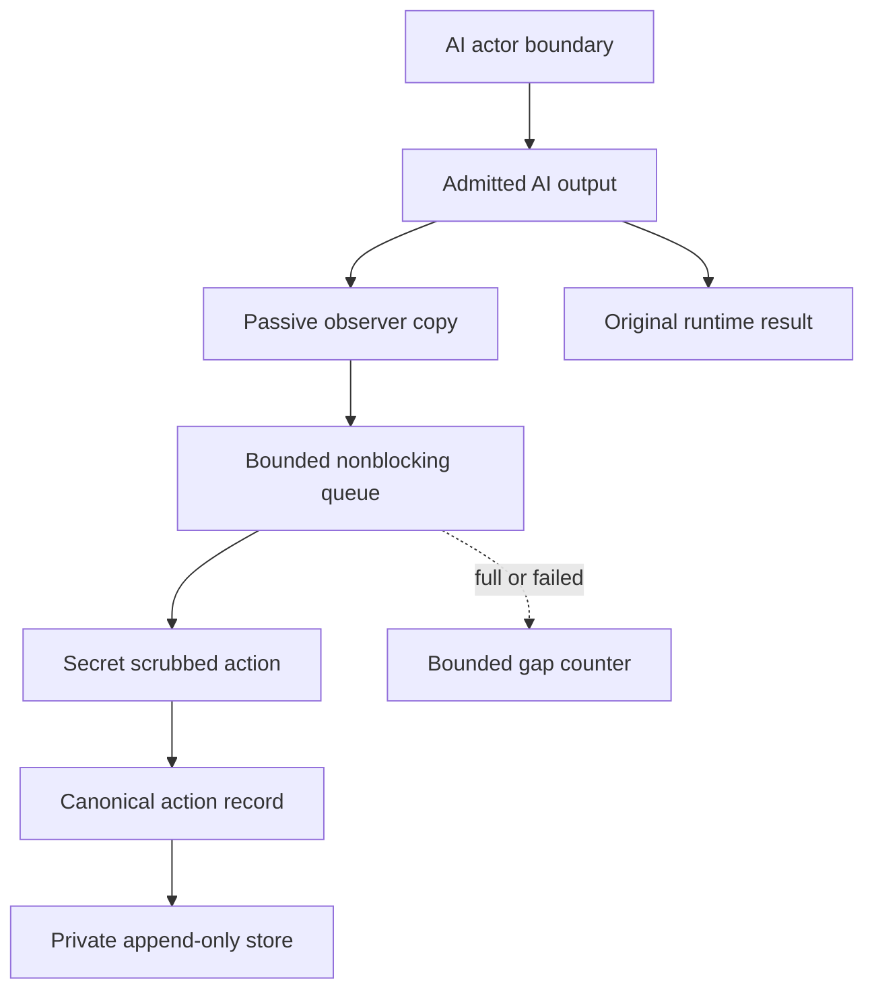

# Courtroom Stenographer

The Courtroom Stenographer is NEXUS's passive, append-only record of admitted
AI actions. Its lore names are **Sky-Earth Lord**, **Divine Dragon-House**, and
**Knowledge-Watchman**. Those names are narrative only: the component's job is
`watchman_only`, its scope is `ai_actions_only`, and it has no authority.

## Boundary

The Stenographer may observe an AI result after an actor boundary returns it.
It cannot prompt an actor, cast or change a vote, decide a Council outcome,
dispatch a command, mutate WorldStore, TrapStore or auth state, or alter the AI
output being returned to its caller.



Each AI call site performs only a bounded in-memory copy/scrub and nonblocking
handoff. A single daemon observer performs lock acquisition, full-lineage
verification, canonical writes and fsync outside the AI response path. The
queue holds at most 256 pending actions; saturation drops the observer copy and
records `observer_queue_full` rather than delaying the original result.

Recording errors are contained by the observer. The original response,
Council lifecycle, ballot processing and Trap transcript continue unchanged.
`complete_since_process_start: false` and the bounded `gap_count` make any
observer failure visible without pretending the record is complete.

## Recorded actions

Every successful AI result admitted through the implemented NEXUS actor seams
has one registered action type:

| Action type | Boundary |
|---|---|
| `actor.direct_response` | non-Council `actor.chat` reply |
| `council.phase_response` | every initial or guard-restatement phase reply |
| `council.ballot` | every admitted sealed ballot |
| `failsafe.rehabilitation_response` | bounded Failsafe probe reply |
| `trap.subject_response` | synthetic Trap subject reply |

Deterministic Failsafe relief actors pass through the ordinary Council phase
and ballot boundaries, so their actions use the Council action types. An
adapter/model exception with no returned AI output is not fabricated into an AI
action. An invalid returned value that cannot be represented marks a visible
recording gap.

The recorder intentionally excludes human commands and prose, prompts,
WorldStore/game/auth operations, system health reads, model catalogues,
contained system messages and deterministic control-plane decisions. Prompt or
message content is not copied into the ledger; a `stimulus:<sha256>` binding and
bounded non-prose context identify the invocation. AI output text and ballot
rationales are locally secret-scrubbed before persistence.

## Canonical record

Each immutable object is stored as owner-only canonical JSON and addressed as
`steno:<sha256>`. A record contains:

```json
{
  "record_ref": "steno:<sha256>",
  "record_type": "ai_action_record",
  "payload": {
    "schema_version": "nexus-stenographer/1",
    "sequence": 1,
    "previous_record_ref": null,
    "recorded_at_utc": "2026-08-09T00:00:00.000000Z",
    "lore": {
      "name": "Courtroom Stenographer",
      "titles": ["Sky-Earth Lord", "Divine Dragon-House", "Knowledge-Watchman"],
      "job": "watchman_only",
      "record_scope": "ai_actions_only",
      "lore_is_authority": false
    },
    "authority": {
      "prompt": false,
      "vote": false,
      "decide": false,
      "command": false,
      "mutate_world": false,
      "mutate_trap": false,
      "mutate_auth": false,
      "alter_ai_output": false
    },
    "action": {
      "action_type": "actor.direct_response",
      "actor": {
        "member_id": "A",
        "model_id": "model-a",
        "adapter_id": "mock",
        "actor_kind": "DeterministicMockActor"
      },
      "context": {
        "session_id": null,
        "phase": null,
        "mode_id": "analytical",
        "geometry_region_id": "observatory",
        "evidence_snapshot_ref": null,
        "attempt": "direct_response",
        "stimulus_ref": "stimulus:<sha256>",
        "synthetic_context": false
      },
      "output": {
        "kind": "text",
        "text": "bounded scrubbed output",
        "stored_char_count": 23,
        "secret_scrubbed": false,
        "scrubbed_types": []
      }
    }
  }
}
```

The hash covers the complete payload, including sequence and
`previous_record_ref`. This forms one linear immutable ledger. A small canonical
`stenographer-index.json` is only a cache: startup and verification reconstruct
the sequence from object lineage and repair a missing or rolled-back index.
Forks, gaps, broken links, changed content, unsafe file types and cross-store
references fail closed.

Persistent roots, object directories, index, lock and record files are private
to the owner on POSIX (`0700` directories and `0600` files). The root must be
disjoint from auth, WorldStore and TrapStore roots and may not traverse symbolic
links. One interprocess lock serializes append and index replacement.
The lock is acquired only by the background observer or an explicit read/
verification operation, never by the AI response path. Read views wait up to a
bounded drain interval for accepted observations and otherwise return a
sanitized `stenographer_observer_busy` error.

## Read-only interfaces

Start the JSONL runtime with a persistent private store:

```bash
python -m nexus_runtime \
  --world .nexus-world \
  --trap-root .nexus-trap \
  --stenographer-root .nexus-stenographer
```

The installed CLI uses `.nexus-stenographer` by default and exposes only reads:

```bash
nexus stenographer status
nexus stenographer list --limit 100
nexus stenographer list --action-type council.ballot --member-id A
nexus stenographer inspect steno:<sha256>
nexus stenographer verify
nexus stenographer summary
nexus stenographer export
```

The export operation returns the ordered record references and ledger head; it
does not write to an operator-supplied path. There is no public record, edit,
clear or delete operation. List results are also capped by a two-MiB canonical
record budget and report `truncated` rather than building an unbounded JSONL
response.

The Rust TUI adds `#stenographer` and the read-only `/steno` namespace:

```text
/join #stenographer
/steno status
/steno list 50
/steno inspect steno:<sha256>
/steno verify
/steno summary
/steno export
```

Plain room text cannot start a Council or direct-model action there. A hidden,
exact lore invocation reveals a display-only Easter egg. The reveal is neither
authentication nor authority, is not advertised by `system.operations`, and
cannot mutate any runtime state.

## Limits and claims

- This is a local study record, not a legal transcript, a provider-side audit
  log, complete DLP, or proof of what happened inside a model.
- It records outputs admitted at NEXUS actor seams, not hidden reasoning,
  provider operational events, network packets or actions outside this runtime.
- Full AI output may be sensitive even after high-confidence secret scrubbing.
  Protect, retain and share the private store accordingly.
- File integrity detects later mutation; it does not make the same-account host
  or clock trustworthy.
- A visible gap counter is more honest than blocking or rewriting an AI result
  when observation fails.
